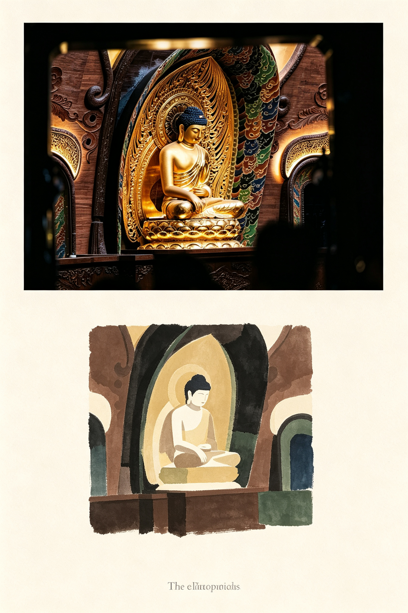
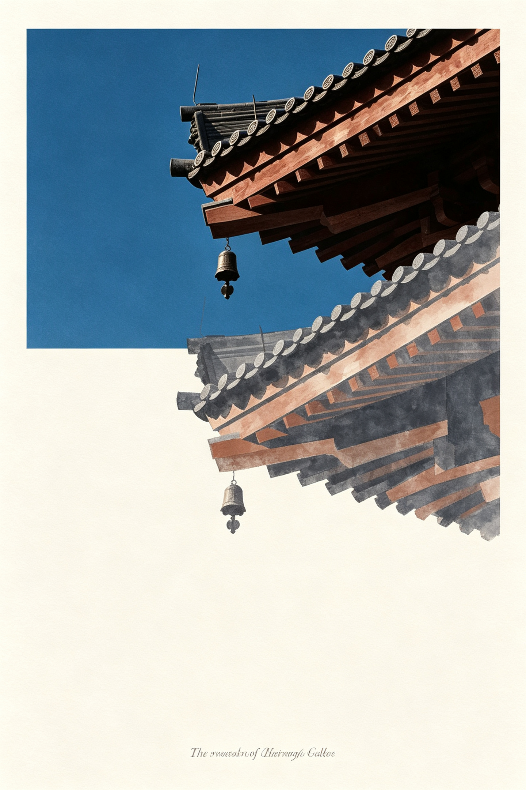
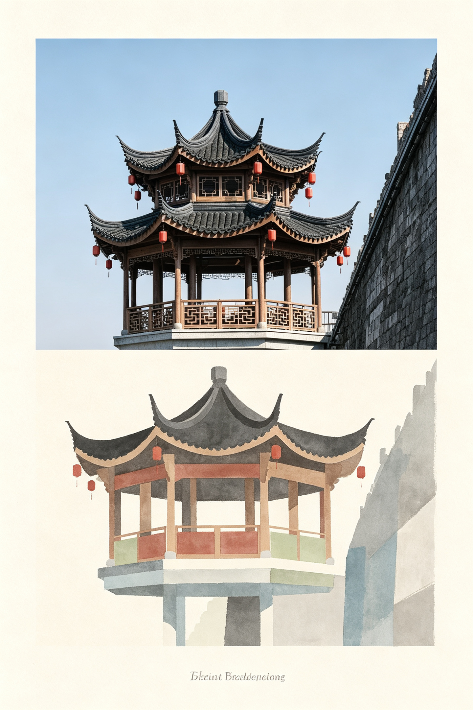
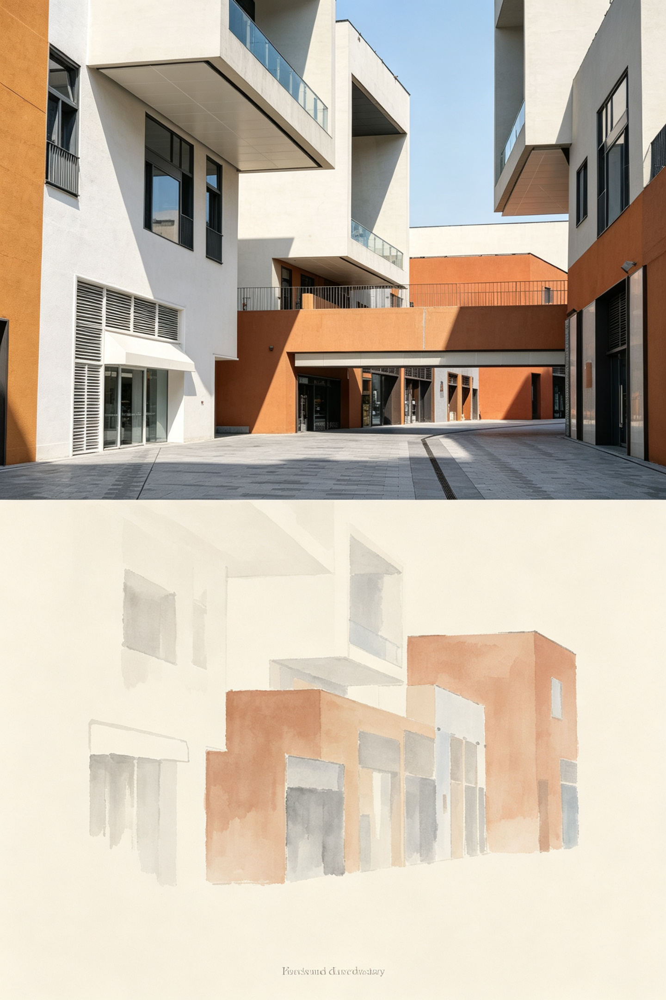

# Vertical Split Postcard

竖向二分构图的哑光米白画册明信片生成技能。把一张或多张实拍参考照片变成明信片：上半部分完整保留原图写实照片，下半部分改为水墨扁平解构插画，最底部加一行纤细优雅的衬线英文标题。

## 功能特点

- **竖向二分构图**：上半为原图写实照片，不做改图、裁剪、重打光或风格化；下半为独立米色留白区域。
- **水墨扁平解构**：下半部分把照片中的建筑、地标、景物简化成低饱和柔和色块，带淡墨晕染边缘，无锐利硬线。
- **固定核心提示词**：`references/prompt-spec.md` 提供可直接复用的固定核心提示词与最终组装顺序。
- **批量系列输出**：多张参考图可生成风格统一、各自保留场景布局的明信片系列。
- **内置校验清单**：SKILL.md 中提供画面分割、上半保真、下半风格、配色、排版和留白的检查项。
- **5 张示例成图**：`examples/` 内含 5 张示例海报，可直接作为风格参考。

## 安装

Codex 从 `~/.codex/skills/<skill-name>/SKILL.md` 加载技能。

```bash
git clone https://github.com/Nick-Job/vertical-split-postcard.git
cp -R vertical-split-postcard ~/.codex/skills/
```

重启 Codex 后，把实拍照片发给它，并说：

- "把这张照片做成竖向二分构图米白明信片"
- "把我的这几张照片做成一系米白画册明信片"

## 使用方式

1. 提供一张或多张实拍照片，可以是建筑、寺庙、地标或旅行场景。
2. 技能会先分析每张图的构图、配色、光线和主体。
3. 按 `references/prompt-spec.md` 的固定顺序生成提示词，并将参考图作为风格和主体参考传给图像生成工具。
4. 若在 ChatGPT 中使用，可把生成的提示词连同原图一起提交给 GPT Image 2。

## 项目结构

```text
vertical-split-postcard/
├── SKILL.md                       # 技能入口与工作流
├── agents/
│   └── openai.yaml                # 面向 Agent 的展示元数据
├── references/
│   ├── prompt-spec.md             # 固定核心提示词与组装规则
│   └── examples.md                # 已适配的真实场景示例
└── examples/                      # 5 张示例成图
```

## 示例










## License

本项目仅供个人学习与使用，禁止商用。请勿将技能、提示词或生成结果用于商业用途。 (For personal study and non-commercial use only. Commercial use is prohibited.)
